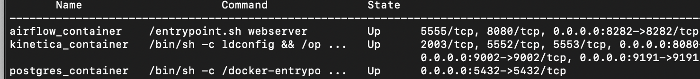
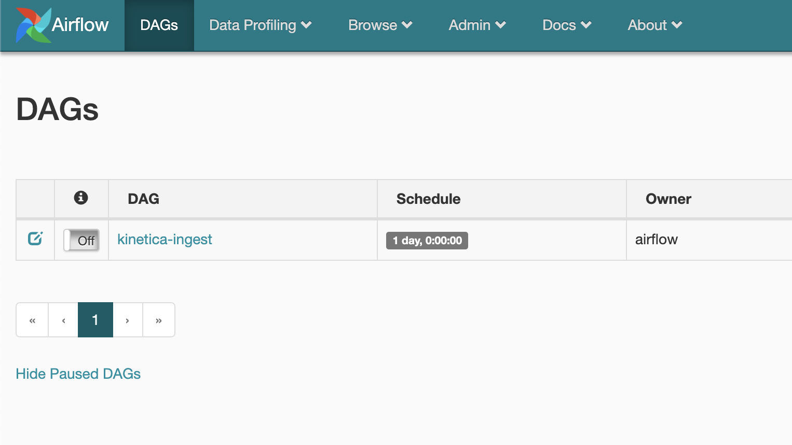
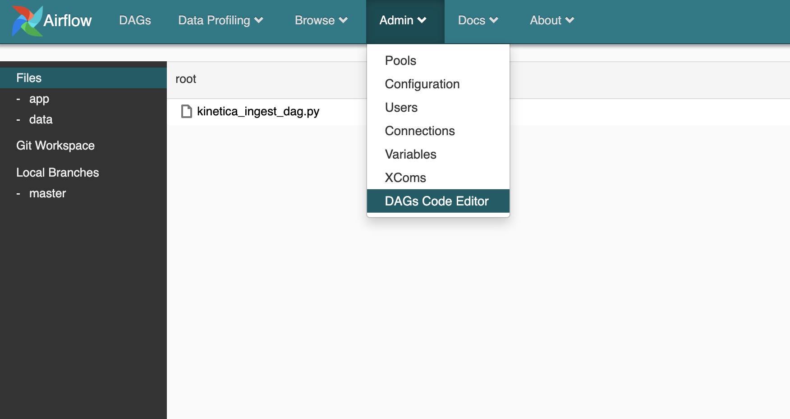

# Kinetica Airflow Lab

Kinetica ETL lab using docker containers and Airflow


## Lab Introduction
In this lab you will ingest geometric data into Kinetica using AirFlow.  The data is a simple CSV file of all counties in US.

The entire project is built with Docker containers and linked using a customer Docker network.  To read more on this take a look here [Docker Custom Network](https://docs.docker.com/compose/networking/#specify-custom-networks)

### Services in this Lab

* Airflow
* Kinetica
* Postgres (for airflow backend)
* CDAP (Optional)
* Spark Master/Worker (Optional)

The CDAP and spark containers are included in a separate docker compose file, but not used during this lab.  In this lab the Spark environment is included in the Airflow container therefore separate containers will not be used - this is known as Local spark mode.  If you would like to run in Spark standalone mode then the  master and worker containers can be used.  To learn more about spark standalone mode check out this link: [Spark Standalone](https://spark.apache.org/docs/2.4.0/spark-standalone.html)

---

### Getting Started

1. Clone this lab repository 
	* `git clone https://github.com/pheer/kinetica-airflow-lab.git`
2. Install [Docker](https://docs.docker.com/get-docker/) and [Docker Compose](https://docs.docker.com/compose/install/) - pick your OS
3. Open command line and run `docker --version` and `docker-compose --version` to make sure both installed corretly
4. Run `docker ps` to make sure docker is able to connect to engine and list any running containers.  If this is new install there should be no containers listed
5. Change into lab working directory and start stack
	* `cd kinetica-airflow-lab`
	* `docker-compose up`  or `docker-compose up -d` to run in detached or background mode

It will take a while to download containers if this is the first time running the stack.  

`docker-compose ps` should show our three running containers:




Check AirFlow UI at http://localhost:8282/admin/




**Configure**

* login to [Kinetica](http://localhost:8080) user: **admin** password: **admin**
	* Activate a Kinetica License and start `Admin -> Start` and `Start` again
	* Logout and log back in - change password to `KineticaFlow1!`

* Make sure airflow user owns the directories run: `docker exec --user root -it airflow_container chown -R airflow:airflow .`
* In [AirFlow UI](http://localhost:8282) go to `Admin -> Connections`, find `spark_default`, and hit pencil icon to edit
* Set `host` property from `yarn` to `local`
	

### Ingest & Data

To learn more about Airflow click [here](https://airflow.apache.org/docs/apache-airflow/stable/tutorial.html#tutorial)

This lab version of Airflow has a [DAG code editor](https://pypi.org/project/airflow-code-editor/) already installed - in order to access this click `Admin -> DAGs Code Editor`



Notice there are three folders mounted to easily edit files from Airflow vs command line. 

* **Files** (root) <- this folder holds the Airflow Dags
* **app** <- this holds the application data files.  In our case this is the spark program and conf file
* **data** <- this folder holds any data files.  For this lab there is a `us_counties.csv` file

Any other editor can be used to edit these files.  Here are the mount mappings from host to container.  `project_home` is where you checked out the lab.

* project_home/dags -> /usr/local/airflow/dags
* project_home/spark/app -> /app
* project_home/spark/resources/data -> /data
* project_home/spark/resources/libs -> /libs


**Create Table in Kinetica**
* Go to [Kinietica UI](http://localhost:8080) `Query -> SQL`
* Add following DDL to textarea and hit `Run SQL`


```sql
CREATE TABLE "ki_home"."us_counties"
(
   "WKT" geometry,
   "STATEFP" VARCHAR (2),
   "COUNTYFP" VARCHAR (4),
   "COUNTYNS" VARCHAR (8),
   "AFFGEOID" VARCHAR (16),
   "GEOID" VARCHAR (8),
   "NAME" VARCHAR (32),
   "LSAD" VARCHAR (2),
   "ALAND" VARCHAR (16),
   "AWATER" VARCHAR (16)
)
```

**Run Airflow ETL job**

See video below on how to run the Kinetica ingest job from airflow UI.


---

The dag file holds the high level configuration of the job: `kinetica_ingest_dag.py` under `dags` folder.  See more on scheduling jobs (for example, how to run a job every night at 8PM).  check [here](https://airflow.apache.org/docs/apache-airflow/1.10.1/scheduler.html)

Take a look at the `kinetica_ingest.py` file under spark/app.  This file reads the CSV file using the following line:

```python
    df = spark.read.format("csv").option("header", "true").load(appOpts.get('input_dir'))

```

Once the data is loaded into a Spark data frame it can be written to Kinetica using the following line:

```python
    df.write.format("com.kinetica.spark").options(**kineticaIngest).save()

```

The write method uses the Kinetica Spark connector to write the dataframe to Kinetica.  This connector handles all the mapping and Kinetica specific ingest details.  See [Kinetica Spark Connector](https://github.com/kineticadb/kinetica-connector-spark) for more details.


Take a look at the configuration for the job at `spark/app/conf.py`.  Notice the section `kineticaIngest`,  here is where Kinetica connection information is configured.

If an Airflow job fails - click the red failed job circle in Airflow UI and clear task to retry/rerun job.  

---


